# Manual de Usuario de la Aplicación Back-End

## Introducción
Este manual tiene como objetivo guiar a los usuarios no experimentados en el uso de la aplicación Back-End. Aquí aprenderás a manejar las funciones principales de la página web, como crear, editar y eliminar eventos, además de suscribirte o eliminarte de ellos.

---

## Tabla de Contenidos
1. [Inicio de Sesión](#inicio-de-sesión)
2. [Registro](#registro)
3. [Panel de Administración](#panel-de-administración)
4. [Funciones del Usuario](#funciones-del-usuario)
   - [Ver Eventos Disponibles](#ver-eventos-disponibles)
   - [Registrarse en un Evento](#registrarse-en-un-evento)
   - [Gestionar Tus Eventos](#gestionar-tus-eventos)
5. [Funciones del Organizador](#funciones-del-organizador)
   - [Crear Eventos](#crear-eventos)
   - [Editar y Eliminar Eventos](#editar-y-eliminar-eventos)

---

## Inicio de Sesión
Para acceder a la aplicación:
1. Dirígete a la pantalla de inicio de sesión.
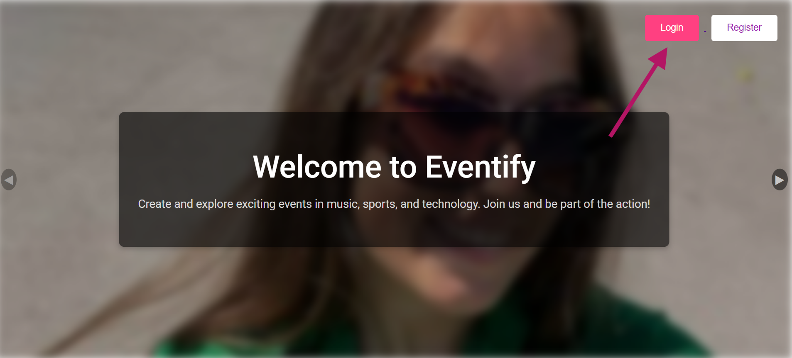
2. Ingresa tu **correo electrónico** y **contraseña**.
3. Haz clic en el botón **Entrar**.
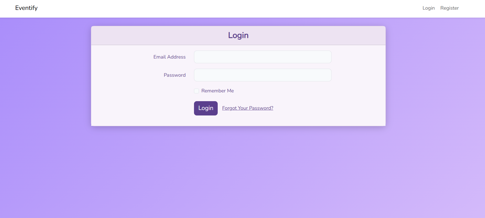
[⬆ Volver a la Tabla de Contenidos](#tabla-de-contenidos)
---

## Registro
Para crear una cuenta:
1. Accede a la página de registro.
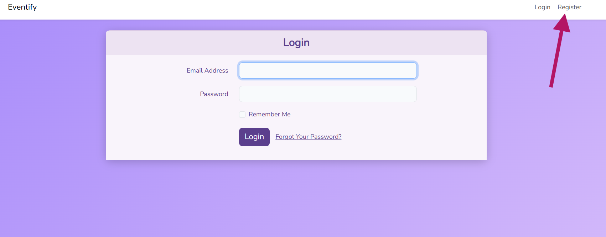
2. Completa el formulario con los siguientes datos:
   - Selecciona el tipo de usuario: **Usuario** o **Organizador**.
   - Nombre.
   - Correo electrónico.
   - Contraseña y confirmación de contraseña.
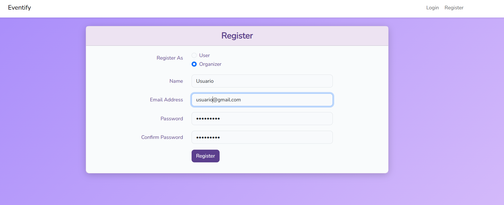
3. Haz clic en **Registrarse**.
4. Valida tu correo haciendo clic en el enlace recibido por email.
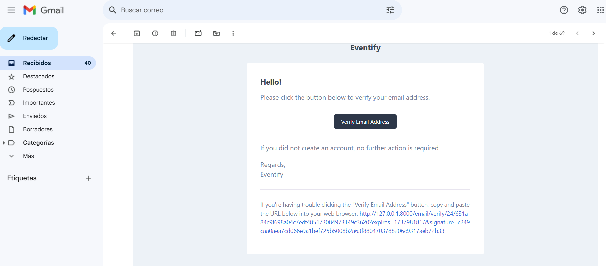
5. Espera a que el administrador active tu cuenta.
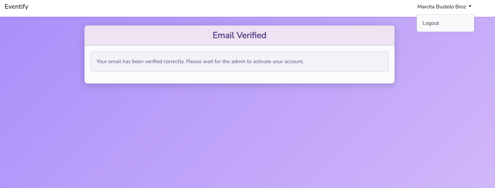
[⬆ Volver a la Tabla de Contenidos](#tabla-de-contenidos)
---

## Panel de Administración
### Funciones del Administrador
- **Ver Usuarios:** Lista completa de los usuarios registrados.
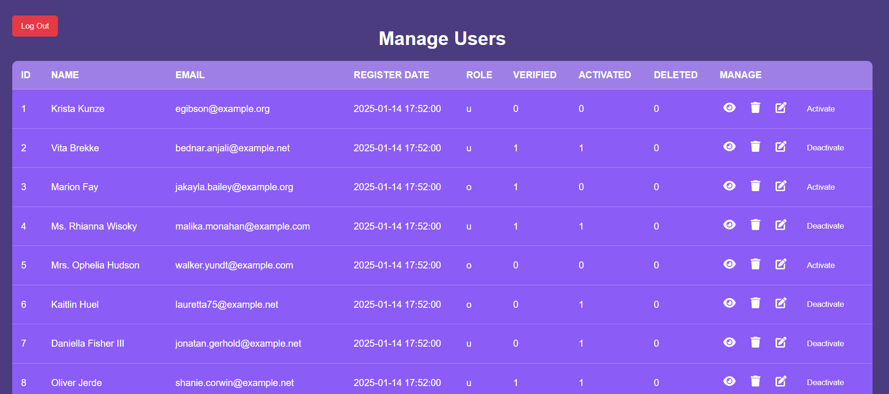
- **Visualizar un Usuario:** Visualizar información de un solo usuario.
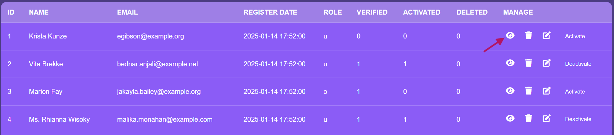

- **Activar/Desactivar Usuarios:** Habilita o deshabilita el acceso de usuarios.
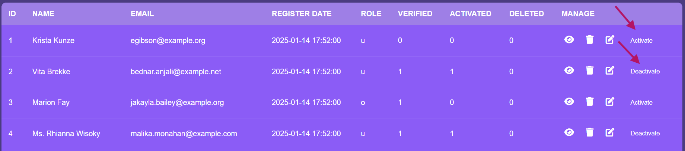
- **Editar Usuarios:** Modifica la información de cualquier usuario.
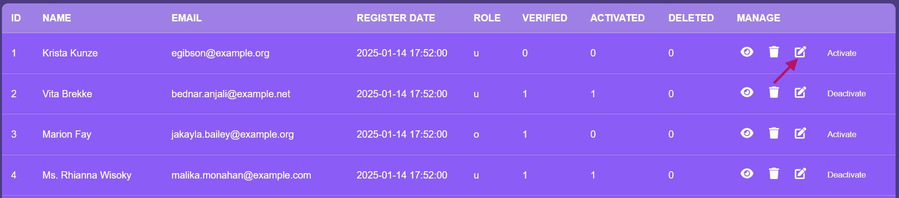
- **Eliminar Usuarios:** Elimina usuarios.
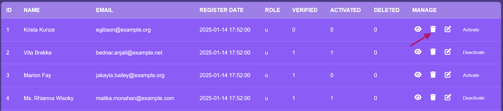
[⬆ Volver a la Tabla de Contenidos](#tabla-de-contenidos)
---

## Funciones del Usuario

### Ver Eventos Disponibles
1. Accede al menú y selecciona la opción **Events**.
2. Visualiza los eventos disponibles a partir del día siguiente en los que aún no estés registrado.
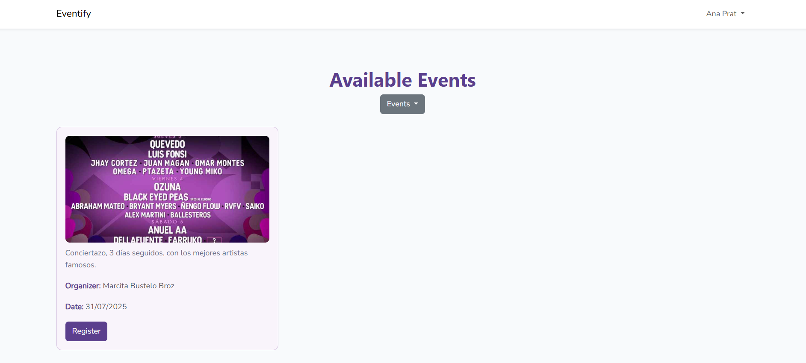

### Registrarse en un Evento
1. Desde la lista de eventos disponibles, haz clic en el botón **Registrarse** del evento deseado.
2. El evento desaparecerá de la lista una vez registrado.
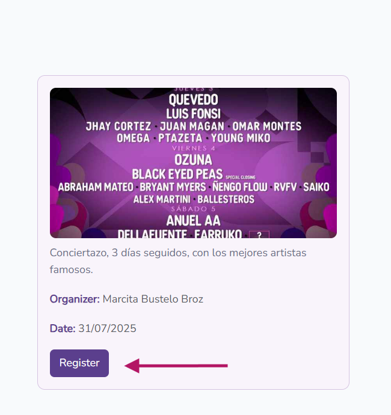

### Gestionar Tus Eventos
1. Accede al menú y selecciona **My Events**.
2. Visualiza todos los eventos en los que estás registrado.
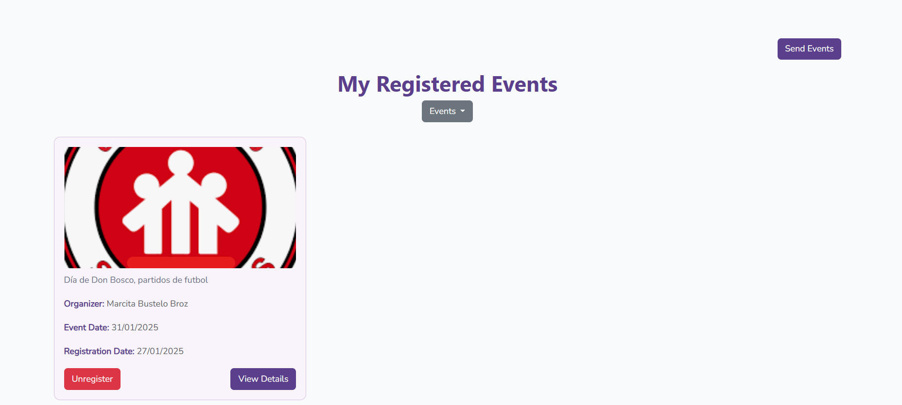
3. Opciones disponibles:
   - **Ver Información:** Consulta los detalles del evento.
   - **Cancelar Registro:** Elimínate del evento.
   - **Enviar Eventos:** Recibe un correo con un PDF de los eventos en los que estás registrado.
   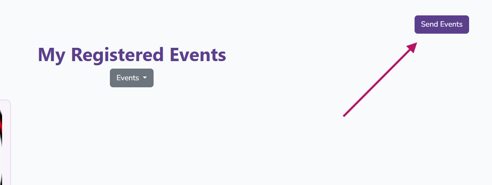
[⬆ Volver a la Tabla de Contenidos](#tabla-de-contenidos)
---

## Funciones del Organizador
Ver todos los eventos.
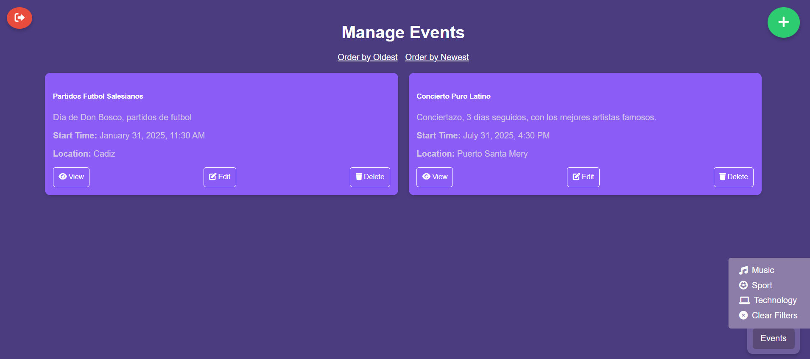

### Crear Eventos
1. Selecciona **Crear Evento** que es un botón con la forma +. 
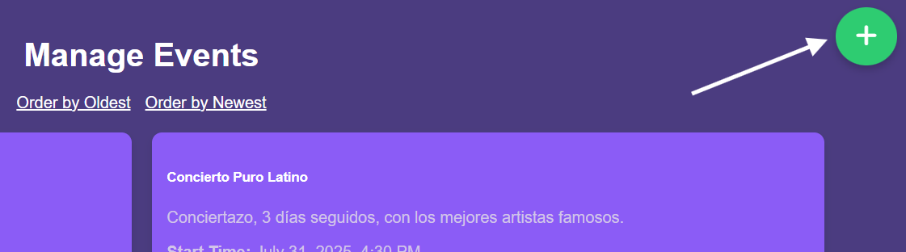
2. Completa el formulario con la información del evento.
3. Haz clic en **Guardar** para registrar el evento.
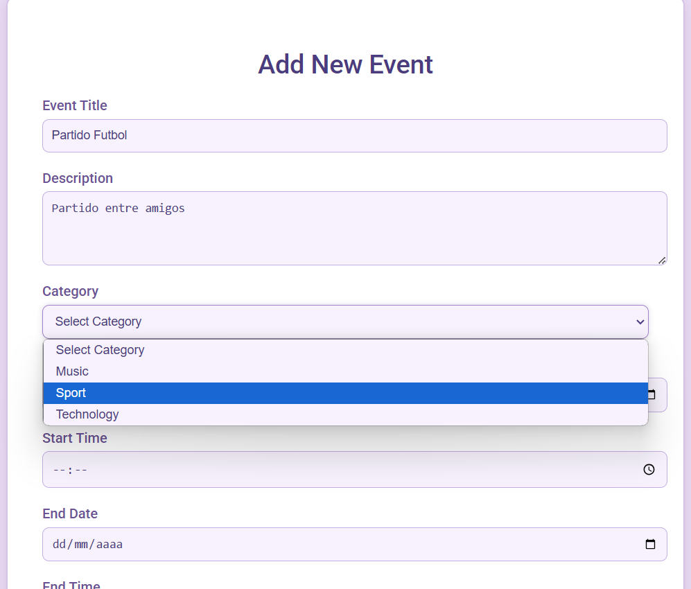 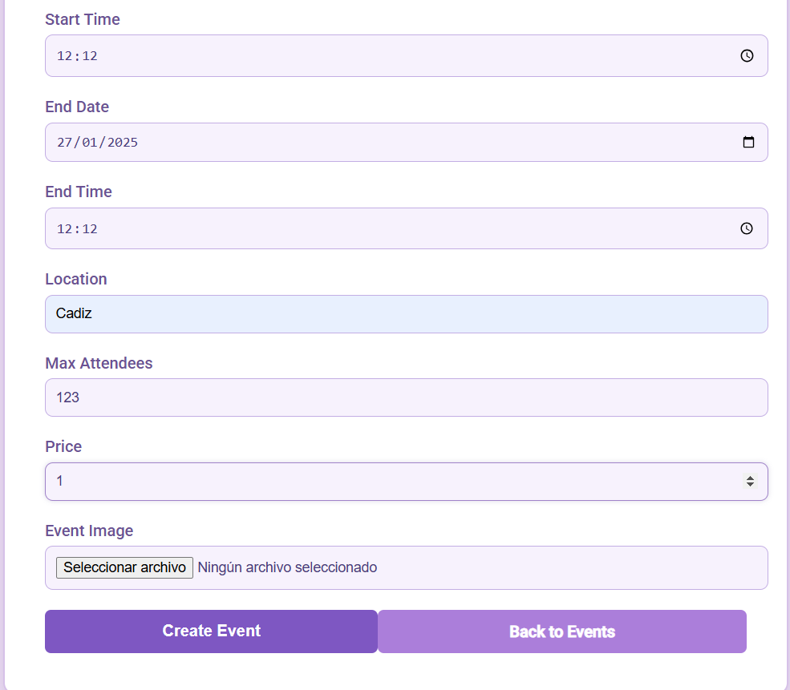

### Editar y Eliminar Eventos
1. Desde la lista de eventos creados, poder manejarlos.
2. Opciones disponibles:
   - **Visualizar:** Visualizar los detalles del evento.
   - **Editar:** Modifica los detalles del evento.
   - **Eliminar:** Borra el evento de la lista.
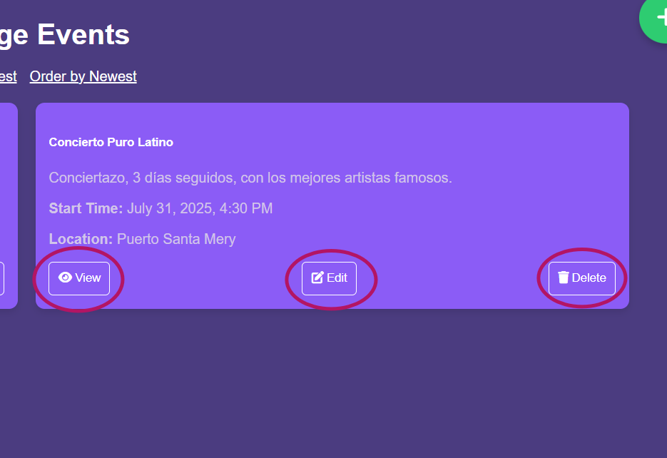
[⬆ Volver a la Tabla de Contenidos](#tabla-de-contenidos)
---

¡Gracias por usar nuestra aplicación! 😊
