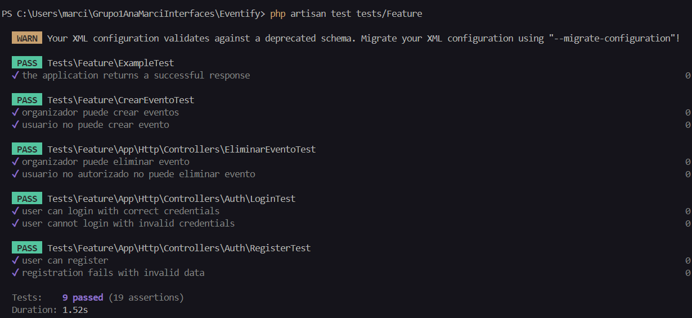

# Manual de Usuario de la Aplicación Back-End

## Introducción
Este manual tiene como objetivo guiar a los usuarios no experimentados en el uso de la aplicación Back-End. Aquí aprenderás a manejar las funciones principales de la página web, como crear, editar y eliminar eventos, además de suscribirte o eliminarte de ellos.

---

## Tabla de Contenidos
1. [Inicio de Sesión](#inicio-de-sesión)
2. [Registro](#registro)
3. [Panel de Administración](#panel-de-administración)
4. [Funciones del Usuario](#funciones-del-usuario)
   - [Ver Eventos Disponibles](#ver-eventos-disponibles)
   - [Registrarse en un Evento](#registrarse-en-un-evento)
   - [Gestionar Tus Eventos](#gestionar-tus-eventos)
5. [Funciones del Organizador](#funciones-del-organizador)
   - [Crear Eventos](#crear-eventos)
   - [Editar y Eliminar Eventos](#editar-y-eliminar-eventos)
6. [Pruebas Unitarias](#pruebas-unitarias)
6. [API de Autenticación y Gestión de Eventos](#api-de-autenticación-y-gestión-de-eventos)

---

## Inicio de Sesión
Para acceder a la aplicación:
1. Dirígete a la pantalla de inicio de sesión.

2. Ingresa tu **correo electrónico** y **contraseña**.
3. Haz clic en el botón **Entrar**.

[⬆ Volver a la Tabla de Contenidos](#tabla-de-contenidos)
---

## Registro
Para crear una cuenta:
1. Accede a la página de registro.

2. Completa el formulario con los siguientes datos:
   - Selecciona el tipo de usuario: **Usuario** o **Organizador**.
   - Nombre.
   - Correo electrónico.
   - Contraseña y confirmación de contraseña.

3. Haz clic en **Registrarse**.
4. Valida tu correo haciendo clic en el enlace recibido por email.

5. Espera a que el administrador active tu cuenta.

[⬆ Volver a la Tabla de Contenidos](#tabla-de-contenidos)
---

## Panel de Administración
### Funciones del Administrador
- **Ver Usuarios:** Lista completa de los usuarios registrados.

- **Visualizar un Usuario:** Visualizar información de un solo usuario.


- **Activar/Desactivar Usuarios:** Habilita o deshabilita el acceso de usuarios.

- **Editar Usuarios:** Modifica la información de cualquier usuario.

- **Eliminar Usuarios:** Elimina usuarios.

[⬆ Volver a la Tabla de Contenidos](#tabla-de-contenidos)
---

## Funciones del Usuario

### Ver Eventos Disponibles
1. Accede al menú y selecciona la opción **Events**.
2. Visualiza los eventos disponibles a partir del día siguiente en los que aún no estés registrado.


### Registrarse en un Evento
1. Desde la lista de eventos disponibles, haz clic en el botón **Registrarse** del evento deseado.
2. El evento desaparecerá de la lista una vez registrado.


### Gestionar Tus Eventos
1. Accede al menú y selecciona **My Events**.
2. Visualiza todos los eventos en los que estás registrado.

3. Opciones disponibles:
   - **Ver Información:** Consulta los detalles del evento.
   - **Cancelar Registro:** Elimínate del evento.
   - **Enviar Eventos:** Recibe un correo con un PDF de los eventos en los que estás registrado.
   
[⬆ Volver a la Tabla de Contenidos](#tabla-de-contenidos)
---

## Funciones del Organizador
Ver todos los eventos.


### Crear Eventos
1. Selecciona **Crear Evento** que es un botón con la forma +. 

2. Completa el formulario con la información del evento.
3. Haz clic en **Guardar** para registrar el evento.
 


### Editar y Eliminar Eventos
1. Desde la lista de eventos creados, poder manejarlos.
2. Opciones disponibles:
   - **Visualizar:** Visualizar los detalles del evento.
   - **Editar:** Modifica los detalles del evento.
   - **Eliminar:** Borra el evento de la lista.

[⬆ Volver a la Tabla de Contenidos](#tabla-de-contenidos)
---

## Pruebas Unitarias
Para comprobar los test unitarios tienes que poner en la terminal php artisan test tests/Feature.
Una vez hayas puesto eso en la terminal te saldran los test y si funcionan o dan error. Si todo esta bien tendria que salirte como en la siguiente imagen.  


## API de Autenticación y Gestión de Eventos

Endpoints de Autenticación
### 1. **Login (POST)** `/api/login`
   - **Descripción**: Inicia sesión con el correo electrónico y la contraseña del usuario.
   - **URL de ejemplo**:
     ```
     http://eventifyapi.duckdns.org/api/login?email=testUsuario@gmail.com&password=12345678
     ```
   - **Parámetros**:
     - `email`: Correo electrónico del usuario.
     - `password`: Contraseña del usuario.
   - **Resultado esperado**:
     ```json
     {
       "success": true,
       "data": {
       "token": "4|qEbKZmmCoR7UxfauG7RNLGYSgNmel0kqY3hdovmM4b945279",
       "name": "testUuario"
       },
       "message": "User login successfully."
     }
     ```

### 2. **Register (POST)** `/api/register`
   - **Descripción**: Registra un nuevo usuario en la plataforma.
   - **URL de ejemplo**:
     ```
     http://eventifyapi.duckdns.org/api/register?name=testUuario&email=testUsuario@gmail.com&password=12345678&c_password=12345678
     ```
   - **Parámetros**:
     - `name`: Nombre completo del usuario.
     - `email`: Correo electrónico del usuario.
     - `password`: Contraseña.
     - `c_password`: Confirmación de la contraseña.
   - **Resultado esperado**:
     ```json
     {
       "success": true,
       "data": {
       "token": "1|ux1WGeDbdIO8n03l2xKxRbkjSonczqObIPY94ovd11d717e9",
       "name": "testUuario"
       },
       "message": "User register successfully."
     }
     ```

---

## Endpoints de Gestión de Usuarios

### 3. **Obtener Todos los Usuarios (GET)** `/api/users`
   - **Descripción**: Muestra una lista de todos los usuarios registrados.
   - **URL de ejemplo**:
     ```
     http://eventifyapi.duckdns.org/api/users
     ```
   - **Resultado esperado**:
     ```json
     {
       "success": true,
       "data": [
        {
            "id": 22,
            "name": "Marcita",
            "email": "marcitabuxtelo@gmail.com",
            "email_verified_at": "05/02/2025",
            "role": "o",
            "profile_picture": "marcita.jpg",
            "actived": 1,
            "email_confirmed": true,
            "deleted": 0,
            "remember_token": "WZcfEsYoWliuh8UhFZVYFqVwH4Wz26BY4bYvGTrmbM7YtBFQCFn0ocRxoBem",
            "created_at": "05/02/2025",
            "updated_at": "05/02/2025"
        },
        {
            "id": 23,
            "name": "Ana Prat",
            "email": "anaprat26@gmail.com",
            "email_verified_at": "05/02/2025",
            "role": "u",
            "profile_picture": "anaprat.jpg",
            "actived": 1,
            "email_confirmed": true,
            "deleted": 0,
            "remember_token": "ODY6Xpg9HH",
            "created_at": "05/02/2025",
            "updated_at": "05/02/2025"
        },
       ],
       "message": "Users retrieved successfully"
     }
     ```

### 4. **Buscar y Ver un Usuario Específico (GET)** `/api/users/{user}`
   - **Descripción**: Muestra los detalles de un usuario específico por su ID.
   - **URL de ejemplo**:
     ```
     http://eventifyapi.duckdns.org/api/users/22
     ```
   - **Resultado esperado**:
     ```json
     {
        "success": true,
        "data": {
        "id": 22,
        "name": "Marcita",
        "email": "marcitabuxtelo@gmail.com",
        "email_verified_at": "05/02/2025",
        "role": "o",
        "profile_picture": "marcita.jpg",
        "actived": 1,
        "email_confirmed": true,
        "deleted": 0,
        "remember_token": "WZcfEsYoWliuh8UhFZVYFqVwH4Wz26BY4bYvGTrmbM7YtBFQCFn0ocRxoBem",
        "created_at": "05/02/2025",
        "updated_at": "05/02/2025"
        },
        "message": "User retrieved successfully."
        }
     ```

---

## Endpoints de Gestión de Eventos

### 5. **Obtener Todos los Eventos (GET)** `/api/events`
   - **Descripción**: Muestra una lista de todos los eventos registrados en la plataforma.
   - **URL de ejemplo**:
     ```
     http://eventifyapi.duckdns.org/api/events
     ```
   - **Resultado esperado**:
     ```json
     {
       "success": true,
       "data": [
          {
            "id": 10,
            "organized_id": 33,
            "title": "Voluptas explicabo ullam nemo non.",
            "description": "Itaque occaecati dolorum cupiditate minus officiis sunt. Voluptatem adipisci neque doloremque distinctio. Eligendi sequi nobis dolore iure. Tempora quia sed vel aut.",
            "category_id": 3,
            "start_time": "2025-02-16 19:20:11",
            "end_time": "2025-03-26 18:09:44",
            "location": "4585 Welch Springs Suite 079\nGudrunville, GA 00723",
            "latitude": "-69.4929480",
            "longitude": "132.8233330",
            "max_attendees": 180,
            "price": "325.50",
            "image_url": "default.jpg",
            "deleted": 0,
            "created_at": "2025-02-05T09:12:29.000000Z",
            "updated_at": "2025-02-05T09:12:29.000000Z"
        }
        ],
        "message": "Events retrieved successfully."
     }
     ```

### 6. **Crear un Evento (POST)** `/api/events`
   - **Descripción**: Permite añadir un nuevo evento a la plataforma.
   - **URL de ejemplo**:
     ```
     http://eventifyapi.duckdns.org/api/events?organized_id=22&title=Concierto&description=Lleno de artistas de todo el mundo&category_id=1&start_time=2025-01-06%2016:54:24&end_time=2025-06-06%2016:54:24&location=San Fernando&max_attendees=5000&price=90.97
     ```
   - **Parámetros**:
     - `organized_id`: ID del organizador del evento.
     - `title`: Título del evento.
     - `description`: Descripción del evento.
     - `category_id`: ID de la categoría del evento.
     - `start_time`: Fecha y hora de inicio del evento.
     - `end_time`: Fecha y hora de finalización del evento.
     - `location`: Ubicación del evento.
     - `max_attendees`: Máximo de asistentes.
     - `price`: Precio del evento.
   - **Resultado esperado**:
     ```json
     {
       "success": true,
       "data": {
        "organized_id": "22",
        "title": "Concierto",
        "description": "Lleno de artistas de todo el mundo",
        "category_id": "1",
        "start_time": "2025-01-06 16:54:24",
        "end_time": "2025-06-06 16:54:24",
        "location": "San Fernando",
        "max_attendees": "5000",
        "price": "90.97",
        "updated_at": "2025-02-05T09:42:42.000000Z",
        "created_at": "2025-02-05T09:42:42.000000Z",
        "id": 11
        },
        "message": "Event created successfully."
     }
     ```

### 7. **Ver un Evento Específico (GET)** `/api/events/{event}`
   - **Descripción**: Muestra los detalles de un evento específico por su ID.
   - **URL de ejemplo**:
     ```
     http://eventifyapi.duckdns.org/api/events/11
     ```
   - **Resultado esperado**:
     ```json
     {
       "success": true,
       "data": {
        "id": 11,
        "organized_id": 22,
        "title": "Concierto",
        "description": "Lleno de artistas de todo el mundo",
        "category_id": 1,
        "start_time": "2025-01-06 16:54:24",
        "end_time": "2025-06-06 16:54:24",
        "location": "San Fernando",
        "latitude": null,
        "longitude": null,
        "max_attendees": 5000,
        "price": "90.97",
        "image_url": null,
        "deleted": 0,
        "created_at": "2025-02-05T09:42:42.000000Z",
        "updated_at": "2025-02-05T09:42:42.000000Z"
        },
        "message": "Event retrieved successfully."
     }
     ```

### 8. **Actualizar un Evento (PUT)** `/api/events/{event}`
   - **Descripción**: Permite actualizar un evento existente.
   - **URL de ejemplo**:
     ```
     http://eventifyapi.duckdns.org/api/events/11?title=Conciertazo
     ```
   - **Parámetros**:
     - `title`: Título del evento (si se desea actualizar).
   - **Resultado esperado**:
     ```json
     {
       "success": true,
       "data": {
        "id": 11,
        "organized_id": 22,
        "title": "Conciertazo",
        "description": "Lleno de artistas de todo el mundo",
        "category_id": 1,
        "start_time": "2025-01-06 16:54:24",
        "end_time": "2025-06-06 16:54:24",
        "location": "San Fernando",
        "latitude": null,
        "longitude": null,
        "max_attendees": 5000,
        "price": "90.97",
        "image_url": null,
        "deleted": 0,
        "created_at": "2025-02-05T09:42:42.000000Z",
        "updated_at": "2025-02-05T09:42:42.000000Z"
        },
         "message": "Event updated successfully."

     }
     ```

### 9. **Eliminar un Evento (DELETE)** `/api/events/{event}`
   - **Descripción**: Elimina un evento existente de la plataforma.
   - **URL de ejemplo**:
     ```
     http://eventifyapi.duckdns.org/api/events/11
     ```
   - **Resultado esperado**:
     ```json
     {
        "success": true,
        "message": "Event deleted successfully."
     }
     ```

---

¡Gracias por usar nuestra aplicación! 😊
